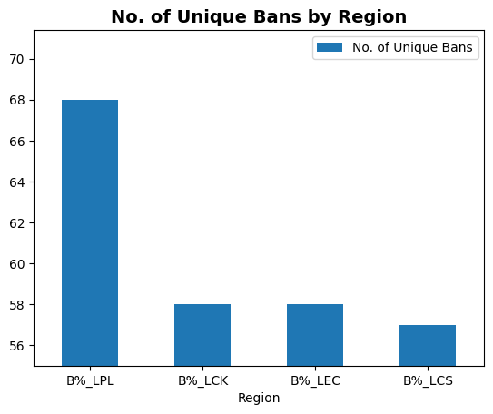
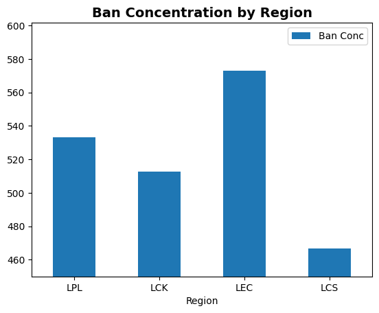

# LoL-Spring-2024-Regional-Ban-Analysis
A passion project to analyse and interpret the ban rates during the Spring 2024 playoffs within 4 different regions in LoL Pro play by a first timer in data analytics :D

#Hypothesis: 
LCK and LPL have lower variability in bans compared to LEC and LCS.

#Methodology: 
Data sets used were downloaded from Oracle's Elixir.
Data sets consisted of the different champions and their ban % during the 'Spring 2024 Playoffs' in the 4 major regions LPL, LCK, LEC and LCS.
The different data sets were cleaned and analyzed by region with the following metrics: Number of Unique Champion Bans, Ban Concentration and Standard Deviation of Bans. 

#Findings:
Number of Unique Bans by Region

Ban Concentration by Region

Standard Deviation of Bans by Region

#Key Observations:
1) LPL is the most diversified in terms of unique champion bans (68 unique bans vs ~57-58 unique bans in other regions).
2) LEC ranks the highest in both Ban Concentration and Standard Deviation of bans.
3) LPL and LCK rank rather similarly in both concentration and standard deviation and they both rank below LEC but above LCS. 
4) LPL has both a higher concentration and standard deviation than LCK. 
5) LCS ranks the lowest across all 3 metrics.

#Interpretations:
1) LPL having the largest number of unique bans but a lower standard deviation than the LEC suggests that the LPL explores the most champions, but the LEC has the greatest variability in ban priorities.
2) The LEC ranking the highest in both concentration and standard deviation seems contradictory at first as a high concentration suggests low variability while a high standard deviation suggests the opposite. However, this can be explained as the LEC ban% data set being more tightly packed whilst having more outliers as compared to the other regions, thus reflecting that the LEC shows strong ban preferences regarding certain champions, while ignoring others.
3) Suggests that LPL and LCK are more diverse in bans than the LCS but less so than the LEC
4) LCS having the lowest unique bans suggests a limited pool of banned champions, while the low concentration and standard deviation suggests that the bans are spread more evenly across a narrower and more predictable range in the LCS.

#Limitations:
1) The datasets investigated and analyzed consists of only the Spring 2024 Playoffs, not the entire Spring split. This was done to keep the analysis between regions across mostly the same patch.
2) However, the LCS Spring Playoffs were played on patch 14.5, a patch where the champion, Azir, was banned. Other regions played their Playoffs on patch 14.6 where Azir was open for play. Additionally, between the 2 different patches, different champions would have been considered 'strong' and 'weak', leading to differences in ban priority.
3) We did not analyze a dataset for the baseline meta during these patches. As such, there is no way for us to know how the different regions ban priorities were affected by the meta.
4) Additionally, we did not consider the different roles in which champions were being played. For example, the champion 'Poppy' has been known to be flexed into 3 different roles: Top, Jungle and Support. Teams could have banned Poppy more than other champions to prevent her from being played in different roles but that would not be reflected in our analysis. 

#Conclusion:
Hypothesis Rejected
From the data collected and analyzed, the variability of bans can be ranked as follows: LEC (most variable), LPL, LCK, LCS (least variable).
The LEC shows the greatest ban variability due to the high standard deviation and concentration, suggesting strong opinions with sharp drop-offs, while the LCS shows the lowest variability due to them having the lowest standard deviation, suggesting the most predictable and evenly distributed bans. 
